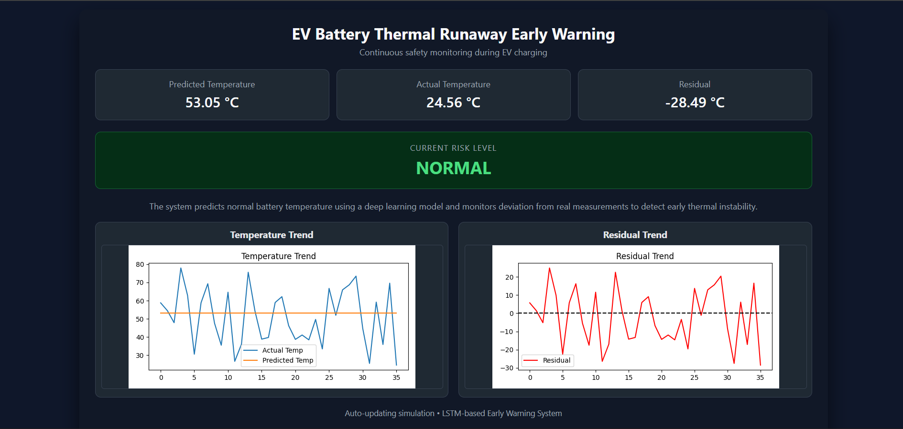
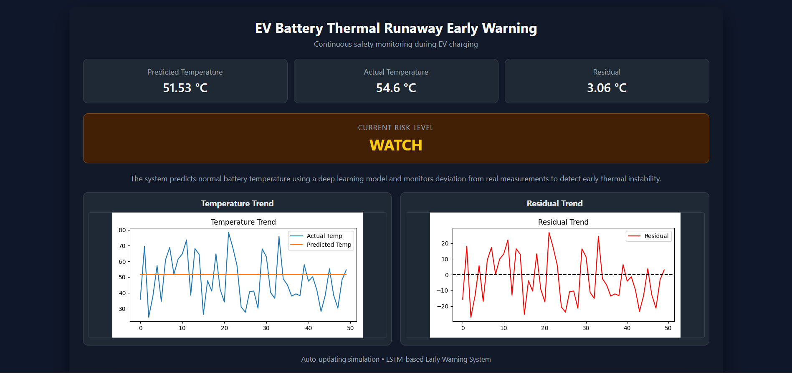
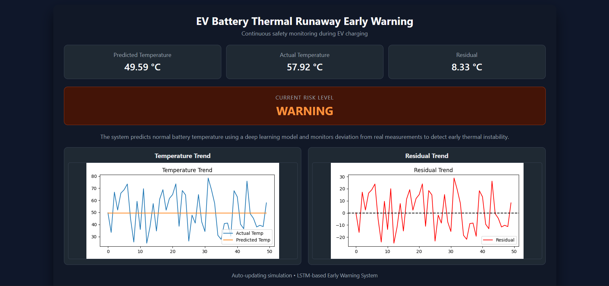
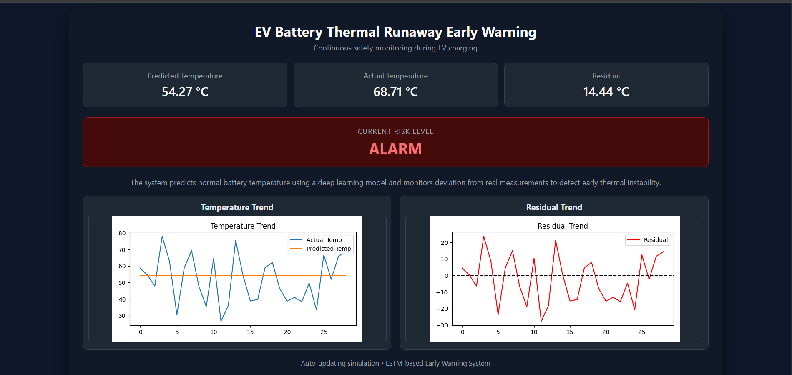

🔗 Live Demo: https://ev-thermal-runaway-system.onrender.com

# 🚗 EV Battery Thermal Runaway Early Warning System

A deep learning–based early warning system for detecting thermal instability in electric vehicle (EV) batteries during charging.
The system predicts abnormal thermal behavior **before thermal runaway occurs**, enabling preventive action and improving EV safety.

## 📌 Problem Statement
Thermal runaway is one of the primary causes of electric vehicle (EV) battery fires, especially during charging.
Conventional Battery Management Systems (BMS) rely on fixed temperature and voltage thresholds, which are reactive and often trigger alarms only seconds before failure.

**Objective:**  
Design a data-driven system that detects early-stage thermal instability using time-series modeling.

## 💡 Core Concept
Thermal runaway is not a sudden event. It is preceded by gradual, time-dependent degradation and abnormal internal heat generation.
This system:
- Learns normal battery charging behavior
- Predicts expected battery temperature
- Measures deviation between predicted and actual temperature
- Uses sustained deviation as an early warning signal

## 🧠 System Workflow
EV Charging Data (CSV)
↓
Feature Engineering
↓
Sliding Time Window (Last 20 timestamps)
↓
LSTM Time-Series Model
↓
Predicted Temperature
↓
Residual = Actual − Predicted
↓
Risk Classification
(NORMAL → WATCH → WARNING → ALARM)
↓
Web Dashboard (Flask)

## 🔍 Risk Levels Explained
| Risk Level | Description |
|-----------|-------------|
| NORMAL | Battery behavior is stable |
| WATCH | Early deviation detected |
| WARNING | Persistent abnormal thermal trend |
| ALARM | High thermal instability — immediate action required |

## 📊 Dashboard Screenshots

### NORMAL State

### WATCH State

### WARNING State

### ALARM State

## 🛠️ Tech Stack
- Python  
- PyTorch (LSTM)  
- Flask  
- Pandas, NumPy  
- Matplotlib  
- HTML, CSS  
- Git & GitHub  

## ⚙️ System Operation
- The LSTM model is trained on normal EV charging data
- It learns the expected temporal behavior of battery temperature
- During runtime:
  - Recent charging data is passed as a sliding window
  - The model predicts expected temperature
  - Residuals are calculated
- Large and persistent residuals indicate thermal instability even if absolute temperature values appear safe

## ▶️ How to Run Locally
### Clone the repository
bash
git clone https://github.com/Saurav08s/EV-Battery-Thermal-Runaway-Early-Warning-System.git
cd EV-Battery-Thermal-Runaway-Early-Warning-System

## Create virtual environment
python -m venv venv
venv\Scripts\activate

Install dependencies
pip install -r requirements.txt

Run the application
python app.py

Open in browser
http://127.0.0.1:5000

## ✅ STEP 10 — Deployment Section
markdown
## 🚀 Deployment
The project is deployment-ready and can be hosted on platforms such as:
- Render
- Railway

A live deployment link can be added here after hosting.

## 🎯 Why This Project Is Useful
- Solves a real-world EV safety problem
- Moves beyond threshold-based detection
- Uses time-series deep learning
- Focuses on early warning rather than late-stage alarms
- Demonstrates end-to-end ML system design and deployment

## 👨‍💻 Author

**Saurav Sanket**  
B.Tech, Electrical Engineering  
Interested in Machine Learning, Data Science, and Software Engineering  

GitHub: https://github.com/Saurav08s

## 📌 Note
This project simulates real-time monitoring using historical data and is intended for educational and research purposes.

🔥 This project is not just a model — it is a complete early warning system.

